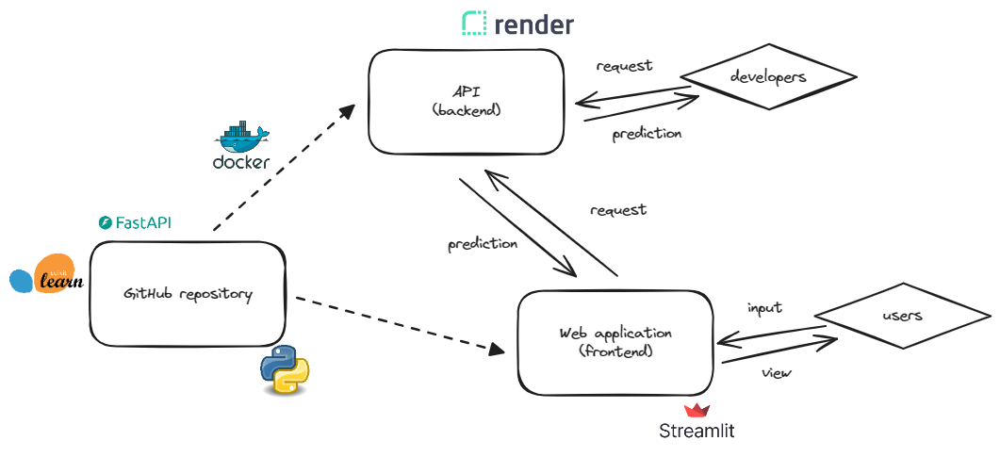

# 🏡 Immo-Eliza Property Price Prediction 

This project is a web application for predicting property prices using a FastAPI backend and a Streamlit frontend. The backend processes user input data, performs preprocessing, and uses a trained machine learning model to make predictions.


##🌐 Live Application

The application is deployed and accessible at:

🔗 Immo-Eliza Property Price Prediction

* Frontend (Streamlit): The main user interface is available on the above link.
* Backend API (FastAPI): The API is integrated into the same link and accessible via endpoints (e.g., /docs for API documentation).


#📝 Table of Contents
Overview
Repo structure
Architecture
Features
Tech Stack
Installation
Usage
Deployment
Project Structure
Contributing


##📖 Overview

###This project serves two main purposes:

###1. Public User Interface:

* Provides an intuitive and interactive web interface via Streamlit, where users can input property details like the type of property (apartment or house), total area, and number of bedrooms.
* The input data is sent to the backend for preprocessing and prediction using a machine learning model.
* The predicted property price is displayed back to the user.

###2. Developer API Interface:

* Exposes an API using FastAPI for developers who want to integrate the prediction model into their own applications.
* Developers can use tools like Swagger UI or Postman to interact with the API directly, sending input data and receiving predictions.


## 📦 Repo structure
```.
│   Dockerfile.fastapi
│   Dockerfile.streamli
│   app.py
│   streamlit.py
│   predict.py    
│   requirements.txt    
│   render.yaml
│   gb.LGBM_Regressor_Apartment.pkl
│   gb.LGBM_Regressor_House.pkl
│   architecture.png
│   README.md
```

* app.py: FastAPI backend application.
* streamlit.py: Streamlit frontend application.
* predict.py: Prediction logic and data preprocessing.
* Dockerfile.fastapi: Dockerfile for FastAPI service.
* Dockerfile.streamlit: Dockerfile for Streamlit service.
* render.yaml: Configuration for deployment on Render.


##🖼️ Architecture

Below is the architecture diagram of the project:




##🔍 Explanation

* The FastAPI backend handles all requests for data preprocessing and prediction.
* The Streamlit frontend provides a user-friendly interface for public users to input property details.
* Developers can interact directly with the API for testing, debugging, and integration into other applications.
* The entire project is containerized using Docker, ensuring consistency across different environments.
* The application is deployed on Render, a cloud platform that automates deployments and scaling.


##✨ Features

* 🏠 Property Price Prediction: Predicts property prices based on user inputs using a trained LightGBM model.
* 🚀 FastAPI Backend: Efficient and scalable API for handling prediction requests.
* 🖥️ Streamlit Frontend: Interactive interface for public users to enter property details.
* 🌐 Dockerized Deployment: Consistent environment using Docker for easy deployment and scalability.
* 📈 Model Selection: Automatically selects the appropriate model based on the property type (apartment or house).


##🛠️ Tech Stack

* Backend: FastAPI, Uvicorn
* Frontend: Streamlit
* Machine Learning: Scikit-learn, LightGBM
* Deployment: Docker, Render
* Programming Language: Python 3.11


##🧩 Data Preprocessing and Prediction

The input data from users or developers is processed by the predict.py
script, which performs the following steps:

1. Data Preprocessing:

* Features such as total_area_per_bedroom are calculated and scaled.
* Encodes categorical features and handles missing values.

2. Model Selection:

* Chooses the appropriate trained model based on the property type: 
    * gb.LGBM_Regressor_Apartment.pkl for apartments.
    * gb.LGBM_Regressor_House.pkl for houses.

3. Prediction:

* Uses the trained LightGBM model to predict the property price.
* Returns the predicted price as a response to the API request.


##💻 Installation

Follow these steps to set up the project locally:

Prerequisites

* Python 3.11
* Docker
* Git


###Clone the Repository:
For Windows:
git clone https://github.com/majidaskary/immo-eliza-deployment.git
cd immo-eliza-deployment

For Linux/Mac:
git clone https://github.com/majidaskary/immo-eliza-deployment.git
cd immo-eliza-deployment

###Set Up a Virtual Environment
For Windows:
python -m venv APIenv
APIenv\Scripts\activate

For Linux/Mac:
python3 -m venv APIenv
source APIenv/bin/activate

###Install Dependencies
For Both Windows and Linux/Mac:
pip install -r requirements.txt

###Build Docker Images
For Both Windows and Linux/Mac:
docker build -t immo-fastapi -f Dockerfile.fastapi .
docker build -t immo-streamlit -f Dockerfile.streamlit .


##🚀 Usage

###Running Locally with Docker
Start the FastAPI and Streamlit services locally.

For Both Windows and Linux/Mac:
docker run -p 8000:8000 immo-fastapi
docker run -p 8501:8501 immo-streamlit

* FastAPI will be available at: http://localhost:8000/docs
* Streamlit will be available at: http://localhost:8501


##Making API Requests

You can test the API using curl or Postman.

For Windows (CMD or PowerShell):
curl -X POST "http://localhost:8000/predict" -H "Content-Type: application/json" -d "{\"property_type\": \"apartment\", \"total_area_sqm\": 100, \"nbr_bedrooms\": 2}"

For Linux/Mac:
curl -X POST "http://localhost:8000/predict" \
-H "Content-Type: application/json" \
-d '{"property_type": "apartment", "total_area_sqm": 100, "nbr_bedrooms": 2}'


##🌐 Deployment

The project is deployed on Render using Docker. The deployment process is automated using the render.yaml configuration file.

###render.yml Configuration:
services:
  - type: web
    name: fastapi-service
    env: docker
    dockerfilePath: Dockerfile.fastapi
    plan: free
    healthCheckPath: "/health"
    autoDeploy: true

  - type: web
    name: streamlit-service
    env: docker
    dockerfilePath: Dockerfile.streamlit
    plan: free
    autoDeploy: true


To trigger a redeployment, push your changes to the GitHub repository:
git add .
git commit -m "Updated deployment settings"
git push origin main


##🤝 Contributing
We welcome contributions! Please fork the repository and create a pull request with your changes.

1. Fork the project
2. Create your feature branch (git checkout -b feature/new-feature)
3. Commit your changes (git commit -m "Add new feature")
4. Push to the branch (git push origin feature/new-feature)
5. Open a pull request


##📞 Contact
For any questions or feedback, please contact:

Find me on [LinkedIn](https://www.linkedin.com/in/majidaskary) for collaboration, feedback, or to connect.
